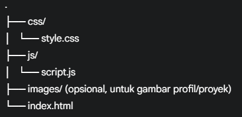

# Website Portofolio Pribadi

Selamat datang di repositori Website Portofolio Pribadi saya! Ini adalah sebuah proyek *front-end* yang dirancang untuk menampilkan profil, keahlian, dan karya-karya saya sebagai seorang *web developer*.

## Tentang Proyek

Website ini dibangun dengan fokus pada desain yang bersih, modern, dan pengalaman pengguna (UX) yang intuitif. Tujuan utama dari portofolio ini adalah untuk menyajikan informasi secara efektif kepada calon pemberi kerja, kolaborator, atau siapa pun yang tertarik dengan hasil kerja saya.

## Fitur Utama

* **Desain Responsif:** Tampilan yang optimal di berbagai perangkat, mulai dari *desktop* hingga *smartphone*.
* **Navigasi Intuitif:** Menu *sticky* dan *hamburger menu* untuk navigasi yang mudah.
* **Hero Section Dinamis:** Bagian pembuka yang menarik dengan efek *parallax* dan *grain*.
* **Profil & Keahlian:** Informasi detail tentang diri saya dan *skillset* teknis.
* **Galeri Proyek:** Menampilkan proyek-proyek yang telah dikerjakan dengan deskripsi, teknologi, dan tautan ke demo/repositori.
* **Formulir Kontak:** Pengunjung dapat mengirim pesan langsung (diimplementasikan dengan Formspree.io).
* **Animasi Scroll:** Efek *fade-in* yang halus saat elemen masuk ke *viewport*.

## Teknologi yang Digunakan

* **HTML5:** Struktur konten semantik.
* **CSS3:** Desain visual, responsivitas, dan animasi.
    * Menggunakan [CSS Custom Properties (Variables)](https://developer.mozilla.org/en-US/docs/Web/CSS/Using_CSS_custom_properties) untuk konsistensi tema.
    * [CSS Grid](https://developer.mozilla.org/en-US/docs/Web/CSS/CSS_Grid_Layout) dan [Flexbox](https://developer.mozilla.org/en-US/docs/Web/CSS/CSS_Flexible_Box_Layout/Basic_Concepts) untuk tata letak.
* **JavaScript (Vanilla JS):** Interaktivitas dan fungsionalitas dinamis.
    * [Intersection Observer API](https://developer.mozilla.org/en-US/docs/Web/API/Intersection_Observer_API) untuk animasi *scroll*.
* **Font Awesome:** Untuk ikon-ikon yang digunakan di seluruh website.
* **Google Fonts (Poppins):** Untuk tipografi yang modern.
* **Formspree.io:** Untuk penanganan pengiriman formulir kontak.

## Struktur Proyek


## Cara Menjalankan Proyek (Lokal)

1.  **Clone repositori ini:**
    ```bash
    git clone (https://github.com/kandarlubis31/PortofolioWebsiteSederhana.git)
    ```
2.  **Masuk ke direktori proyek:**
    ```bash
    cd PortofolioWebsiteSederhana
    ```
3.  **Buka file `index.html`** di *browser* pilihanmu (misalnya, Chrome, Firefox).

## Live Demo

Lihat versi langsung dari website ini di sini:
[https://kandarlubis31.github.io/PortofolioWebsiteSederhana/](https://kandarlubis31.github.io/PortofolioWebsiteSederhana/)

## Kontak

Jangan ragu untuk menghubungi saya melalui:

* **Email:** [nama@email.com] *(Ganti dengan alamat email pribadimu)*
* **LinkedIn:** [Link Profil LinkedIn Kamu] *(Ganti dengan link profil LinkedIn pribadimu)*
* **GitHub:** [https://github.com/kandarlubis31](https://github.com/kandarlubis31)

---

Terima kasih telah mengunjungi portofolio saya!


